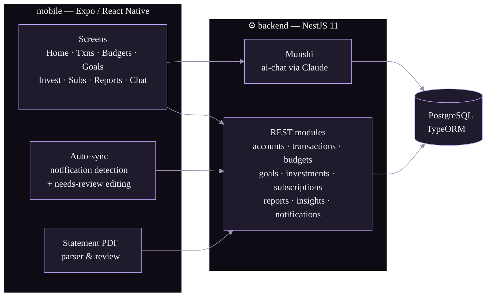

<div align="center">


# Riddhi

**Your money, minded.** A personal finance app with an AI bookkeeper named **Munshi** —
track spends, budgets, goals, subscriptions and investments without the spreadsheet grind.

<br/>


</div>

---

## ✨ What it does

| | |
|---|---|
| 💸 **Transactions** — add, search, group and categorize spends with a custom category tree | 🏦 **Accounts & Cards** — balances, account detail, credit-card tracking |
| 📊 **Budgets** — per-category monthly budgets with progress bars that judge you gently | 🎯 **Goals** — save toward things and watch the bar fill |
| 📈 **Investments** — portfolio tracking with Skia-rendered charts | 🔁 **Subscriptions** — detected from recurring charges, reviewed before confirmed |
| 🧾 **Statements** — import bank statement PDFs, review parsed transactions before they land | 🔔 **Auto-sync** — payment notifications become transactions, uncertain ones go to needs-review |
| 🤖 **Munshi** — chat with an AI bookkeeper that reads your data and answers in plain language | 📋 **Reports & Insights** — where the money actually went |

- **Auto-sync** watches payment notifications on-device, detects transactions and subscriptions, and queues anything uncertain into a **needs-review** flow — editable before it touches your books.
- **Subscriptions** are detected from genuinely recurring charges only, with a review step before anything is confirmed.
- Local-auth (biometric) lock, secure token storage, push notifications, dark & light themes.

## 🖌 Design language

The UI is a warm near-black with a violet cast — glass cards, bento grids, `Plus Jakarta Sans` everywhere, tabular numerals for money.

| Token | Dark | Light | Role |
|-------|------|-------|------|
| `em` |  |  | Emphasis / income |
| `bg` |  |  | Canvas |
| `red` |  |  | Expense / danger |
| `amber` |  |  | Warnings, budgets running hot |
| `blue` |  |  | Transfers |
| `cyan` |  |  | Accents |

Mobile spacing follows an 8pt scale of named tokens ([mobile/src/theme/spacing.ts](mobile/src/theme/spacing.ts)); design tokens live in [mobile/src/theme/tokens.ts](mobile/src/theme/tokens.ts).

## 🏗 Architecture



```
riddhi-app/
├── mobile/     # Expo app — screens, theme, auto-sync, statement parsing
├── backend/    # NestJS API — one module per domain, TypeORM + Postgres
└── logo/       # brand assets
```

## 🚀 Getting started

**Backend**

```bash
cd backend
npm install
npm run seed        # seed the database
npm run start:dev   # http://localhost:3000
```

**Mobile**

```bash
cd mobile
npm install
npm start           # Expo dev server
npm run android     # or: npm run ios / npm run web
```

Point the app at your backend from the in-app backend URL setting on first launch.

## 🧪 Tests

```bash
cd backend && npm test    # unit + e2e (npm run test:e2e)
cd mobile  && npm test    # jest + ts-jest
```

---

<div align="center">
<sub>Built with a violet cast and tabular numerals. 🪔</sub>
</div>
